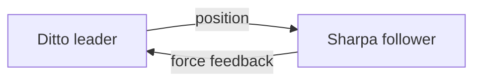

# Teleop math & modes (Ditto ↔ Sharpa)

Bilateral teleop has **two independent axes**, each chosen per finger:

1. **Position** — how the Ditto leader pose drives the Sharpa follower.
2. **Force feedback** — how the Sharpa contact is rendered back as leader motor current.

Each axis can be **joint-level** or **retargeting**. The catch: a joint-level mode
needs a clean 1:1 joint correspondence between the two hands, which only the
**index** has. The **thumb** kinematics differ too much, so the thumb is
**retargeting-only**.

---

## 1. Notation

| Symbol | Meaning |
|---|---|
| $\theta_d,\ \theta_s$ | Ditto / Sharpa joint angle |
| $q_d,\ q_s$ | full Ditto / Sharpa configuration |
| $\tau_d,\ \tau_s$ | Ditto / Sharpa joint torque (Nm) |
| $F$ | fingertip contact force (N), task space |
| $J_d,\ J_s$ | finger Jacobian (fingertip vs joints) for Ditto / Sharpa |
| $s$ | per-joint scale (sign + ratio) |
| $I$ | leader motor current command (mA) |

---

## 2. Position options

| Mode | Equation | Needs | Notes |
|---|---|---|---|
| **Joint-level** | $\theta_{s,j} = s_j\,\theta_{d,j} + \text{offset}_j$ | 1:1 joint map | cheap, direct, runs every cycle |
| **Retargeting (IK)** | Cartesian fingertip match via IK | URDF + IK solver | handles different kinematics / sizes |

**Joint-level.** Each leader joint maps straight to one Sharpa joint:

$$\theta_{s,j} = s_j\,\theta_{d,j} + \text{offset}_j$$

**Retargeting (IK).** The Ditto fingertip pose relative to a common base frame
is measured, Cartesian-scaled per finger (Sharpa is larger), and IK solves the
Sharpa joints so the Sharpa fingertip matches:

$$
{}^{b}T^{*}_{s} = \text{scale}\odot{}^{b}T_{d},
\qquad
\Delta q_s = J_s^{T}\big(J_s J_s^{T} + \lambda^{2} I\big)^{-1} e(q_s)
$$

(damped least squares, iterated; separate position/orientation weights per finger).

---

## 3. Force feedback options

The goal is always a **leader joint torque** $\tau_d$ to render at the Ditto.
How we get there depends on whether the hands share joints.

| Mode | Information used | Mapping to Ditto |
|---|---|---|
| **Joint-level** | measured Sharpa joint torque $\tau_s$ | $\tau_{d,j} = s_j\,\tau_{s,j}$ (direct, per joint) |
| **Retargeting + estimate** | measured Sharpa joint torque $\tau_s$ | $F = (J_s^{T})^{+}\tau_s,\quad \tau_d = J_d^{T} F$ |
| **Retargeting + tactile** | fingertip tactile sensor | $F = \text{sensor},\quad \tau_d = J_d^{T} F$ |

**Joint-level.** With a 1:1 joint correspondence, the felt torque is the measured
Sharpa joint torque mapped straight back:

$$\boxed{\;\tau_{d,j} = s_j\,\tau_{s,j}^{\text{meas}}\;}$$

The same $s_j$ that maps position also maps torque (power conservation:
$\theta_s = s\,\theta_d \Rightarrow \tau_d = s\,\tau_s$), so one knob flips both.

**Retargeting.** The hands don't share joints, so joint torques can't be mapped
directly — we go **through task space**. We need the **fingertip force** $F$,
then push it onto the Ditto leader joints with the leader Jacobian transpose:

$$\tau_d = J_d^{T}(q_d)\,F$$

$F$ comes from one of two sources:

- **Estimate** (from Sharpa joint torques): invert the Sharpa finger statics,

$$F = \big(J_s^{T}(q_s)\big)^{+}\,\tau_s^{\text{meas}}$$

- **Tactile**: read $F$ directly from the fingertip sensor (rotated into the base
  frame). More direct and contact-localized; no model inversion.

---

## 4. Rendering law (shared by all force modes)

Whatever the source, the resulting torque $\tau$ becomes a leader current through
the **same** law (a synthetic "follower current" fed to negative feedback).

**Synthetic follower current:**

$$
\tau_f = \alpha_t\,\tau + (1-\alpha_t)\,\tau_f^{\text{prev}},
\qquad
I_{\text{follow}} = -\,g_{mA}\,\tau_f
$$

($\alpha_t$ = torque LPF, $1$ = off; $g_{mA}$ = torque→current gain).

**Force rendering** — signed deadband, negative feedback, output LPF, clamp:

$$
I_{\text{fr}} =
\begin{cases}
0 & |I_{\text{follow}}| < \tau_{th} \\[4pt]
-k\,\operatorname{sign}(I_{\text{follow}})\,\max\!\big(0,\ |I_{\text{follow}}|-\tau_{th}\big) & \text{(gradual)} \\[4pt]
-k\,I_{\text{follow}} & \text{(standard)}
\end{cases}
$$
$$
I_{\text{fr}} \leftarrow a\,I_{\text{fr}} + (1-a)\,I_{\text{fr}}^{\text{prev}},
\qquad |I_{\text{fr}}| \le I_{\max}
$$

**Force-rendering damping** — only while in contact (follower past deadband),
opposes motion above a velocity floor:

$$
I_{\text{damp}} = -\operatorname{sign}(\dot\theta)\,k_d\,\max\!\big(0,\ |\dot\theta| - v_{th}\big),
\qquad |I_{\text{damp}}| \le I_{d,\max}
$$

**Net command to each leader motor:**

$$I_{\text{cmd}} = I_{\text{fr}} + I_{\text{damp}}$$

---

## 5. Per-finger support

| Finger | Position | Force feedback | Why |
|---|---|---|---|
| **Index** | joint-level **or** retargeting | joint-level **or** retargeting (estimate / tactile) | clean 1:1 index joint map exists |
| **Thumb** | retargeting **only** | retargeting only (estimate / tactile) | thumb kinematics differ → no direct joint map |

Position and force are chosen **independently** per finger, so the index can mix
them (e.g. IK position with joint-level force).

---

## 6. Combined modes (top-level configs)

| Config | Index / middle position | Index / middle force | Thumb position | Thumb force |
|---|---|---|---|---|
| `ditto_2f_tactile` / `ditto_3f_tactile` | retarget | tactile | retarget | tactile |
| `ditto_2f_blend` / `ditto_3f_blend` | joint | 50% tactile + 50% measured | retarget | 65% tactile + 35% estimate |
| `ditto_2f_leader_only` / `ditto_3f_leader_only` | — | none | — | none |

Per-finger tuning YAMLs live under `conf/hand_config/fingers/`; older variants under `old/`.
